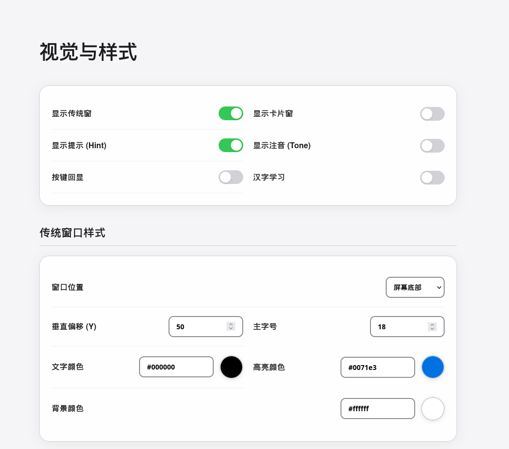

# 👁️ 千言输入法 (Qianyan IME)

> **"千言万语，始于指尖。"** 
> 一款为极致输入体验而生的跨平台 Rust 输入法。

[](https://opensource.org/licenses/MIT)
[]()
[]()

---

## 🌟 为什么选择千言？

千言不仅是一个输入工具，它是对“高效输入”的重新思考。

### 1. 🚀 极致性能 (Rust Powered)
基于 Rust 编写，拥有极低的内存占用和瞬时的响应速度。在 Linux 上支持 **evdev 硬件级拦截**，跳过传统 IBus/Fcitx 的中间层，体验真正的零延迟。

### 2. 🎯 独创 SBSRF 三码笔画辅助系统
- **三码定位**：前两笔 + 末两笔 + 拼音首字母。
- **直观记忆**：独创笔画映射矩阵，将部首转化为简单的字母组合。
- **高效过滤**：拼音输入后接辅助码，精准降噪，首选率提升 80% 以上。

### 3. 🌐 真正的全平台支持
- **Linux**: 支持 evdev (硬件拦截)、IBus、以及原生 Wayland 协议。
- **Windows**: 深度集成 TSF 框架。

### 4. 🛠️ 可视化 Web 配置中心
在浏览器中直接配置你的输入法：即时生效、内置多种双拼方案、样式预览一目了然。

---

## 📸 功能一览

| 智能拼音 | Web 配置中心 | 虚拟键盘练习 |
| :---: | :---: | :---: |
|  |  |  |

---

## 🔥 特色功能清单

- **全能输入**: 全拼、双拼、简拼、笔画（横竖撇捺折）。
- **🎯 英语辅助码**: 拼音 + 英文前缀过滤（如 `pingguo` + `app` $\rightarrow$ `苹果`），中英混输从未如此简单。
- **⚡ 长韵母快输**: 针对 `iang`, `uang` 等复杂韵母支持自定义快速映射，击键次数大幅减少。
- **⌨️ Vim 式导航**: 独创 CapsLock 导航模式，`H/J/K/L` 移动光标与翻页，手指不离主键盘区。
- **💎 词典编辑器**: 内置 Web 端图形化词典管理工具，增删改查、权重调整、批量导入一气呵成。
- **🧠 新词发现**: 智能算法自动从你的输入习惯中提取高频新词，打造最懂你的私人词库。
- **深度自学习**: N-Gram 语言模型 + 用户词库，越用越精准。
- **智能标点**: 支持长按/双击扩展标点、自动配对。
- **生僻字支持**: 内置超大生僻字词库，冷僻姓氏、古籍文字轻松输入。

---

## 🛠️ 安装与运行

### Linux 安装

#### 方式一：使用预编译包 (推荐)
```bash
# 解压并进入目录
tar xzf qianyan-ime-linux-x86_64.tar.gz && cd qianyan-ime

# 系统安装并自动配置权限
sudo ./install.sh
# 运行
qianyan-ime
```

#### 方式二：从源码编译
```bash
# 安装依赖 (Ubuntu/Debian)
sudo apt install rustc cargo libevdev-dev libdbus-1-dev clang

# 编译并安装
cargo build --release
sudo cp target/release/qianyan-ime /usr/local/bin/
```

#### 权限配置 (evdev 模式必需)
1. 将当前用户加入 `input` 组：`sudo usermod -aG input $USER`
2. 创建 udev 规则：
   `echo 'KERNEL=="uinput", GROUP="input", MODE="0660", OPTIONS+="static_node=uinput"' | sudo tee /etc/udev/rules.d/99-qianyan-ime-uinput.rules`
3. 重载规则：`sudo udevadm control --reload-rules && sudo udevadm trigger`
4. **注销并重新登录** 即可生效。

---

## 🏗️ 项目架构 (Engineering)

项目采用 **Rust 工作区 (Workspace)** 架构：

```
qianyan-ime/
├── src/main.rs             # 程序主入口
├── crates/
│   ├── core/               # 核心类型、配置定义 (Config.rs)
│   ├── engine/             # 核心引擎 (FSM, Pipeline, Schemes)
│   ├── ui/                 # 用户界面 (Slint GUI, Web Server)
│   ├── platform-linux/     # Linux 平台实现 (evdev/IBus)
│   └── platform-windows/   # Windows 平台实现 (TSF)
├── configs/                # 运行时 JSON 配置文件
├── dicts/                  # 原始词库 (JSON)
└── static/                 # Web 配置页面资源
```

### 核心 Crate 说明
- **`engine`**: 包含拼音匹配、N-Gram 学习模型、以及 SBSRF 笔画处理逻辑。
- **`ui`**: 基于 Axum 的 Web 服务器提供 `localhost:18765` 配置页面，Slint 负责桌面候选窗。
- **`platform-*`**: 针对不同操作系统处理底层的按键拦截与注入。

---

## 📚 词库结构

- `dicts/chinese/chars/`: 基础字库，分为 Level 1-3。
- `dicts/chinese/words/`: 包含主词库、高频词、Emoji 等。
- `dicts/stroke/`: 专门用于笔画输入的索引数据。
- `data/`: 存放编译后的 FST (Finite State Transducer) 索引，确保毫秒级搜索。

---

## ❓ 常见问题 (FAQ)

**Q: 启动后无法输入？**
A: 请检查是否已将用户加入 `input` 组并重启。运行 `groups` 确认包含 `input` 关键字。

**Q: 如何切换双拼方案？**
A: 访问 `http://localhost:18765`，在“双拼设置”中选择小鹤、自然码等方案，点击保存即刻生效。

**Q: 候选窗位置不准？**
A: 不同的桌面环境（GNOME/KDE/Hyprland）对窗口定位支持不同，建议优先使用 Wayland 后端。

---

## 🤝 参与贡献
本项目采用 [MIT License](LICENSE) 开源。欢迎提交 [Issue](https://github.com/123qweraz/qianyan-ime/issues) 或 Pull Request！

---
> **由 Shian 精心打造，用 Rust 守护你的每一次敲击。**
